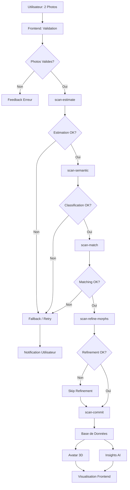

# Pipeline de Scan Corporel - Body Forge

**Version:** 2.0 • **Statut:** Production • **Dernière mise à jour:** Octobre 2025

Le pipeline de scan corporel est le système central de TwinForge permettant de générer un avatar 3D photoréaliste à partir de 2 photos, avec une analyse morphologique complète et des recommandations personnalisées.

---

## 📋 Table des Matières

- [Vue d'Ensemble](#vue-densemble)
- [Architecture du Pipeline](#architecture-du-pipeline)
- [Étapes Détaillées](#étapes-détaillées)
- [Edge Functions](#edge-functions)
- [Flux de Données](#flux-de-données)
- [Contrats TypeScript](#contrats-typescript)
- [Optimisations et Performance](#optimisations-et-performance)
- [Gestion des Erreurs](#gestion-des-erreurs)
- [Coûts et Gouvernance](#coûts-et-gouvernance)

---

## 🎯 Vue d'Ensemble

### Objectif

Transformer 2 photos de l'utilisateur (face et profil) en un avatar 3D photoréaliste avec analyse morphologique complète, permettant:

- **Visualisation 3D interactive** avec contrôles morphologiques en temps réel
- **Analyse morphologique AI** avec classification par archétypes
- **Recommandations personnalisées** basées sur les objectifs de l'utilisateur
- **Suivi d'évolution** avec comparaisons temporelles

### Principes de Conception

- **Pipeline séquentiel** avec 5 étapes distinctes et validées
- **Idempotence garantie** via input_hash pour éviter les duplications
- **Cache intelligent** pour réduire les coûts et latences
- **Fallback robuste** avec dégradation gracieuse en cas d'erreur
- **Traçabilité complète** avec clientScanId end-to-end

---

## 🏗️ Architecture du Pipeline

### Schéma Global

```
┌─────────────────────────────────────────────────────────────────────┐
│                          UTILISATEUR                                 │
│                    (2 Photos: Face + Profil)                        │
└────────────────────────────┬────────────────────────────────────────┘
                             │
                             ▼
┌─────────────────────────────────────────────────────────────────────┐
│                      FRONTEND (React + TS)                          │
│  • Validation photos (format, taille, qualité)                     │
│  • Compression et optimisation client-side                         │
│  • Conversion Base64 pour transmission                             │
│  • État de progression en temps réel                               │
└────────────────────────────┬────────────────────────────────────────┘
                             │
                             ▼
┌─────────────────────────────────────────────────────────────────────┐
│              ÉTAPE 1: scan-estimate (GPT-4o Vision)                 │
│  • Analyse des photos et extraction des mesures                    │
│  • Calcul BMI, masse grasse, masses musculaires                    │
│  • Évaluation qualité photos et confiance                          │
│  • Durée: 8-25s • Coût: ~$0.002-0.008                             │
└────────────────────────────┬────────────────────────────────────────┘
                             │
                             ▼
┌─────────────────────────────────────────────────────────────────────┐
│            ÉTAPE 2: scan-semantic (GPT-5 Mini)                      │
│  • Classification morphologique (body shape)                        │
│  • Détection caractéristiques (épaules, taille, hanches)          │
│  • Évaluation musculature et définition                            │
│  • Analyse posture et alignement                                   │
│  • Durée: 5-15s • Coût: ~$0.0008-0.003                            │
└────────────────────────────┬────────────────────────────────────────┘
                             │
                             ▼
┌─────────────────────────────────────────────────────────────────────┐
│     ÉTAPE 3: scan-match (Algorithmes + GPT-5 Mini)                 │
│  • Sélection des 5 archétypes les plus proches (K=5)              │
│  • Génération de l'enveloppe morphologique                         │
│  • Calcul des paramètres 3D (morph3d)                             │
│  • Calcul des masses par membre (limb_masses)                     │
│  • Durée: 3-10s • Coût: ~$0.0005-0.002                            │
└────────────────────────────┬────────────────────────────────────────┘
                             │
                             ▼
┌─────────────────────────────────────────────────────────────────────┐
│        ÉTAPE 4: scan-refine-morphs (GPT-4o)                        │
│  • Raffinement AI des paramètres morphologiques                    │
│  • Validation cohérence et contraintes                             │
│  • Ajustements précis basés sur l'analyse AI                       │
│  • Documentation des modifications avec raisonnement               │
│  • Durée: 10-30s • Coût: ~$0.001-0.005                            │
└────────────────────────────┬────────────────────────────────────────┘
                             │
                             ▼
┌─────────────────────────────────────────────────────────────────────┐
│              ÉTAPE 5: scan-commit                                   │
│  • Compilation finale des données avatar                           │
│  • Génération modèle 3D et persistance                            │
│  • Mise à jour profil utilisateur                                  │
│  • Création entrée historique                                      │
│  • Durée: 5-15s • Coût: ~$0.0002-0.001                            │
└────────────────────────────┬────────────────────────────────────────┘
                             │
                             ▼
┌─────────────────────────────────────────────────────────────────────┐
│                   BASE DE DONNÉES (PostgreSQL)                      │
│  • body_scans: Données complètes du scan                           │
│  • user_avatars: État avatar actuel de l'utilisateur              │
│  • body_scan_history: Historique avec analyses temporelles        │
└────────────────────────────┬────────────────────────────────────────┘
                             │
                             ▼
┌─────────────────────────────────────────────────────────────────────┐
│                FRONTEND: Visualisation 3D + Insights                │
│  • Avatar3DViewer (Three.js) avec contrôles interactifs           │
│  • Tableau de bord insights morphologiques                         │
│  • Historique et comparaisons temporelles                          │
└─────────────────────────────────────────────────────────────────────┘
```

### Temps de Traitement Total

- **Minimum:** ~31 secondes (conditions optimales)
- **Moyenne:** ~60 secondes (cas standard)
- **Maximum:** ~90 secondes (SLO p95)

---

## 📝 Étapes Détaillées

### Étape 1: scan-estimate (Estimation Initiale)

**Responsable:** Edge Function `scan-estimate`
**Modèle AI:** OpenAI GPT-4o Vision
**Durée:** 8-25 secondes
**Coût:** ~$0.002-0.008

#### Entrées
```typescript
{
  user_id: string;
  front_photo: string;      // Base64
  profile_photo: string;    // Base64
  client_scan_id: string;
  user_profile: {
    sex: 'male' | 'female';
    height_cm: number;
    weight_kg: number;
    age?: number;
    activity_level?: string;
  }
}
```

#### Traitement
1. **Validation des photos:**
   - Format image valide (JPEG/PNG)
   - Taille < 10MB par photo
   - Qualité suffisante (luminosité, netteté)

2. **Analyse AI (GPT-4o Vision):**
   - Détection et validation de la présence du corps complet
   - Extraction des mesures anthropométriques
   - Estimation composition corporelle (masse grasse, muscle)
   - Évaluation confiance et qualité

3. **Calculs complémentaires:**
   - BMI = poids / (taille²)
   - Calibration avec données profil
   - Classification body type préliminaire

#### Sorties
```typescript
{
  success: boolean;
  scan_id: string;
  extracted_data: {
    raw_measurements: {
      height_cm: number;
      weight_kg: number;
      chest_cm?: number;
      waist_cm?: number;
      hips_cm?: number;
      shoulders_cm?: number;
    };
    body_fat_percentage: number;
    muscle_mass_percentage: number;
    processing_confidence: number;
    quality_assessment: {
      front_photo_quality: number;      // 0-1
      profile_photo_quality: number;    // 0-1
      visibility_score: number;         // 0-1
      lighting_score: number;           // 0-1
    };
  };
  estimated_bmi: number;
  body_type_preliminary: string;
  processing_metadata: {
    processing_time_ms: number;
    model_version: string;
    ai_model_used: string;
    tokens_used?: {
      input: number;
      output: number;
    };
  };
}
```

---

### Étape 2: scan-semantic (Classification Sémantique)

**Responsable:** Edge Function `scan-semantic`
**Modèle AI:** GPT-5 Mini + algorithmes morphologiques
**Durée:** 5-15 secondes
**Coût:** ~$0.0008-0.003

#### Entrées
```typescript
{
  scan_id: string;
  estimate_result: ScanEstimateResponse;
  user_profile: UserProfileContext;
}
```

#### Traitement
1. **Classification morphologique:**
   - Body shape: pear, apple, hourglass, rectangle, inverted_triangle
   - Largeur épaules: narrow, average, broad
   - Définition taille: low, moderate, high
   - Proéminence hanches: low, moderate, high

2. **Analyse musculaire:**
   - Muscle definition: low, moderate, high, very_high
   - Distribution musculaire par groupe
   - Symétrie et proportions

3. **Analyse posturale:**
   - Score d'alignement (0-1)
   - Type de posture
   - Corrections recommandées

#### Sorties
```typescript
{
  success: boolean;
  semantic_analysis: {
    body_shape: 'pear' | 'apple' | 'hourglass' | 'rectangle' | 'inverted_triangle';
    morphological_features: {
      shoulder_width: 'narrow' | 'average' | 'broad';
      waist_definition: 'low' | 'moderate' | 'high';
      hip_prominence: 'low' | 'moderate' | 'high';
      leg_length_ratio: 'short' | 'average' | 'long';
    };
    muscle_definition: 'low' | 'moderate' | 'high' | 'very_high';
    posture_analysis: {
      alignment_score: number;
      posture_type: string;
      corrections_needed: string[];
    };
  };
  confidence_scores: Record<string, number>;
  processing_metadata: {
    processing_time_ms: number;
    model_version: string;
  };
}
```

---

### Étape 3: scan-match (Matching d'Archétypes)

**Responsable:** Edge Function `scan-match`
**Modèles:** Algorithmes de matching + GPT-5 Mini
**Durée:** 3-10 secondes
**Coût:** ~$0.0005-0.002

#### Entrées
```typescript
{
  scan_id: string;
  semantic_result: ScanSemanticResponse;
  estimate_result: ScanEstimateResponse;
  user_profile: UserProfileContext;
}
```

#### Traitement
1. **Sélection des archétypes (K=5):**
   - Requête base de données `morph_archetypes`
   - Filtrage par genre et BMI
   - Calcul similarité sémantique
   - Sélection top 5 archétypes les plus proches

2. **Génération enveloppe morphologique:**
   - Blending pondéré des 5 archétypes
   - Calcul morph3d (156 paramètres)
   - Calcul limb_masses (masses par membre)
   - Validation contraintes physiologiques

3. **Score de cohérence:**
   - Cohérence sémantique globale
   - Validité des proportions
   - Respect des contraintes anatomiques

#### Sorties
```typescript
{
  success: boolean;
  matched_archetypes: Array<{
    archetype_id: string;
    archetype_name: string;
    similarity_score: number;
    weight_in_blend: number;
    morph_values: Record<string, number>;
    limb_masses: Record<string, number>;
  }>;
  final_morph_data: Record<string, number>;      // 156 paramètres
  final_limb_masses: Record<string, number>;     // Masses par membre
  semantic_coherence_score: number;
  processing_metadata: {
    processing_time_ms: number;
    archetypes_evaluated: number;
    matching_algorithm: string;
  };
}
```

---

### Étape 4: scan-refine-morphs (Raffinement AI)

**Responsable:** Edge Function `scan-refine-morphs`
**Modèle AI:** GPT-4o avec prompts morphologiques spécialisés
**Durée:** 10-30 secondes
**Coût:** ~$0.001-0.005

#### Entrées
```typescript
{
  scan_id: string;
  match_result: ScanMatchResponse;
  semantic_result: ScanSemanticResponse;
  estimate_result: ScanEstimateResponse;
  user_profile: UserProfileContext;
}
```

#### Traitement
1. **Analyse AI des paramètres:**
   - Évaluation cohérence globale
   - Détection incohérences ou valeurs extrêmes
   - Suggestions d'ajustements précis

2. **Raffinement morphologique:**
   - Ajustements fins des 156 paramètres
   - Optimisation proportions et symétrie
   - Validation contraintes anatomiques
   - Documentation du raisonnement AI

3. **Amélioration confiance:**
   - Calcul amélioration de confiance
   - Score de confiance final
   - Métriques de qualité

#### Sorties
```typescript
{
  success: boolean;
  refined_morphs: Record<string, number>;
  refinement_reasoning: string;
  confidence_improvement: number;
  ai_adjustments: Array<{
    parameter: string;
    original_value: number;
    refined_value: number;
    reasoning: string;
    impact_score: number;
  }>;
  processing_metadata: {
    processing_time_ms: number;
    model_version: string;
    tokens_used?: {
      input: number;
      output: number;
    };
  };
}
```

---

### Étape 5: scan-commit (Génération et Persistance)

**Responsable:** Edge Function `scan-commit`
**Type:** Traitement algorithmique (pas d'AI)
**Durée:** 5-15 secondes
**Coût:** ~$0.0002-0.001 (computational seulement)

#### Entrées
```typescript
{
  scan_id: string;
  user_id: string;
  refine_result: ScanRefineMorphsResponse;
  skin_tone: {
    base_color: string;
    undertone: string;
    saturation: number;
  };
  all_pipeline_results: {
    estimate: ScanEstimateResponse;
    semantic: ScanSemanticResponse;
    match: ScanMatchResponse;
    refine: ScanRefineMorphsResponse;
  };
}
```

#### Traitement
1. **Compilation données avatar:**
   - Consolidation des résultats de toutes les étapes
   - Validation finale de l'intégrité
   - Génération des métadonnées complètes

2. **Persistance base de données:**
   - Insertion dans `body_scans` (données complètes du scan)
   - Mise à jour `user_avatars` (état avatar actuel)
   - Création entrée `body_scan_history` (analyse temporelle)

3. **Mise à jour profil:**
   - Synchronisation automatique des champs profil
   - Mise à jour `avatar_status`, `avatar_url`, `skin_tone`
   - Mise à jour `hip_mass`, `shoulder_mass`, `body_fat_perc`
   - Timestamp `last_avatar_regeneration_at`

4. **Déclenchement génération insights:**
   - Appel asynchrone à `generate-morph-insights` (optionnel)

#### Sorties
```typescript
{
  success: boolean;
  scan_id: string;
  avatar_data: {
    morph3d: Record<string, number>;
    limb_masses: Record<string, number>;
    skin_tone: {
      base_color: string;
      undertone: string;
      saturation: number;
    };
  };
  insights_generated: boolean;
  profile_updated: boolean;
  processing_metadata: {
    total_processing_time_ms: number;
    pipeline_steps_completed: number;
  };
}
```

---

## ⚡ Edge Functions

### Résumé des Edge Functions

| Fonction | Modèle AI | Durée | Coût | Rôle Principal |
|----------|-----------|-------|------|----------------|
| `scan-estimate` | GPT-4o Vision | 8-25s | $0.002-0.008 | Analyse photos + mesures |
| `scan-semantic` | GPT-5 Mini | 5-15s | $0.0008-0.003 | Classification morphologique |
| `scan-match` | Algorithmes + GPT-5 Mini | 3-10s | $0.0005-0.002 | Matching archétypes K=5 |
| `scan-refine-morphs` | GPT-4o | 10-30s | $0.001-0.005 | Raffinement AI précis |
| `scan-commit` | - (Processing) | 5-15s | $0.0002-0.001 | Génération + persistance |

### Architecture Edge Functions

Toutes les Edge Functions suivent l'architecture suivante:

```typescript
// Structure commune
import { corsHeaders } from '../_shared/cors.ts';
import { createClient } from '@supabase/supabase-js';

Deno.serve(async (req: Request) => {
  // 1. Gestion CORS
  if (req.method === 'OPTIONS') {
    return new Response(null, { status: 200, headers: corsHeaders });
  }

  try {
    // 2. Validation du token et extraction user_id
    const authHeader = req.headers.get('Authorization');
    // ...

    // 3. Validation de la requête
    const body = await req.json();
    // Validation avec zod ou similaire

    // 4. Traitement principal
    const result = await processScanStep(body);

    // 5. Logging structuré
    console.log(JSON.stringify({
      level: 'info',
      message: 'Step completed successfully',
      context: {
        userId,
        scanId,
        processingTime,
        cost,
        philosophy: 'body_scan_audit'
      }
    }));

    // 6. Retour résultat
    return new Response(
      JSON.stringify(result),
      {
        headers: { ...corsHeaders, 'Content-Type': 'application/json' }
      }
    );

  } catch (error) {
    // Gestion erreur avec logging
    console.error(JSON.stringify({
      level: 'error',
      message: error.message,
      stack: error.stack,
      context: { userId, scanId }
    }));

    return new Response(
      JSON.stringify({ error: error.message }),
      {
        status: 500,
        headers: { ...corsHeaders, 'Content-Type': 'application/json' }
      }
    );
  }
});
```

---

## 📊 Flux de Données

### Diagramme de Flux Complet



### Gestion des États

```typescript
// États du pipeline (Zustand store)
type ScanPipelineState = {
  status: 'idle' | 'capturing' | 'processing' | 'completed' | 'error';
  currentStep: 'estimate' | 'semantic' | 'match' | 'refine' | 'commit' | null;
  progress: number;  // 0-100
  results: {
    estimate?: ScanEstimateResponse;
    semantic?: ScanSemanticResponse;
    match?: ScanMatchResponse;
    refine?: ScanRefineMorphsResponse;
    commit?: ScanCommitResponse;
  };
  error?: {
    step: string;
    message: string;
    code: string;
  };
};
```

---

## 🔒 Contrats TypeScript

### Interfaces Principales

```typescript
// Requête initiale
interface BodyScanRequest {
  user_id: string;
  front_photo: string;      // Base64
  profile_photo: string;    // Base64
  client_scan_id: string;
  user_profile: UserProfileContext;
}

interface UserProfileContext {
  sex: 'male' | 'female';
  height_cm: number;
  weight_kg: number;
  age?: number;
  activity_level?: string;
  objective?: string;
  body_fat_perc?: number;
}

// Données scan complètes (DB)
interface BodyScanData {
  id: string;
  user_id: string;
  timestamp: string;
  metrics: {
    estimate_result?: ScanEstimateResponse;
    semantic_result?: ScanSemanticResponse;
    match_result?: ScanMatchResponse;
    refine_result?: ScanRefineMorphsResponse;
    commit_result?: ScanCommitResponse;
    final_shape_params?: Record<string, number>;
    final_limb_masses?: Record<string, number>;
    skin_tone?: SkinTone;
    resolved_gender?: 'male' | 'female';
  };
  created_at: string;
  morph3d?: Record<string, number>;
  limb_masses?: Record<string, number>;
  skin_tone?: SkinTone;
}

// Avatar utilisateur (DB)
interface UserAvatar {
  user_id: string;
  current_scan_id?: string;
  morph3d?: Record<string, number>;
  limb_masses?: Record<string, number>;
  skin_tone?: SkinTone;
  updated_at: string;
}

interface SkinTone {
  base_color: string;       // RGB hex
  undertone: string;        // 'warm' | 'cool' | 'neutral'
  saturation: number;       // 0-1
}
```

---

## 🚀 Optimisations et Performance

### Frontend

1. **Validation Photo Côté Client:**
   - Compression images avant upload (< 2MB après compression)
   - Vérification format et dimensions
   - Preview avec feedback qualité en temps réel

2. **Cache React Query:**
   - Clés: `['body:scan', { id }]`, `['avatar:current']`
   - `staleTime`: 24 heures pour données avatar
   - Persistence `localStorage` pour scan en cours

3. **3D Rendering Optimisé:**
   - LOD (Level of Detail) basé sur distance caméra
   - Frustum culling automatique
   - Matériaux PBR optimisés
   - Textures compressées (ASTC/DXT)

### Backend

1. **Cache Serveur:**
   - Clé `input_hash` (SHA256) pour déduplication
   - Cache par étape pipeline (24h-7j selon étape)
   - Invalidation intelligente sur modification profil

2. **Optimisations AI:**
   - Prompts versionnés et optimisés pour tokens
   - Batch processing où possible
   - Retry exponentiel avec fallback

3. **Base de Données:**
   - Index composite: `(user_id, timestamp DESC)`
   - Index unique: `input_hash` pour AI calls
   - RLS activé partout avec policies optimisées

---

## 🛡️ Gestion des Erreurs

### Stratégies de Fallback

```typescript
// Exemple: Fallback si scan-refine-morphs échoue
async function processScanPipeline(request: BodyScanRequest) {
  try {
    // Étapes 1-3 (critiques)
    const estimate = await scanEstimate(request);
    const semantic = await scanSemantic(estimate);
    const match = await scanMatch(semantic);

    // Étape 4 (optionnelle avec fallback)
    let refined = match.final_morph_data;
    try {
      const refineResult = await scanRefineMorphs(match);
      refined = refineResult.refined_morphs;
    } catch (refineError) {
      console.warn('Refinement failed, using match result', refineError);
      // Continue avec les résultats de match
    }

    // Étape 5 (critique)
    const committed = await scanCommit(refined);

    return committed;
  } catch (error) {
    // Gestion erreur globale
    throw new ScanPipelineError(error);
  }
}
```

### Codes d'Erreur

| Code | Description | Action Utilisateur |
|------|-------------|-------------------|
| `PHOTO_INVALID` | Photo format/qualité invalide | Reprendre photo |
| `BODY_NOT_DETECTED` | Corps non détecté sur photo | Améliorer cadrage |
| `ESTIMATION_FAILED` | Échec analyse AI | Réessayer ou support |
| `SEMANTIC_FAILED` | Échec classification | Réessayer ou support |
| `MATCH_NO_ARCHETYPES` | Aucun archétype trouvé | Contact support |
| `REFINEMENT_FAILED` | Échec raffinement (non-bloquant) | Continue avec match |
| `COMMIT_FAILED` | Échec sauvegarde | Réessayer |
| `RATE_LIMIT_EXCEEDED` | Quota dépassé | Attendre ou upgrade |

---

## 💰 Coûts et Gouvernance

### Coûts par Composant

| Composant | Coût Minimum | Coût Maximum | Coût Moyen |
|-----------|--------------|--------------|------------|
| scan-estimate | $0.002 | $0.008 | $0.004 |
| scan-semantic | $0.0008 | $0.003 | $0.0015 |
| scan-match | $0.0005 | $0.002 | $0.001 |
| scan-refine-morphs | $0.001 | $0.005 | $0.002 |
| scan-commit | $0.0002 | $0.001 | $0.0005 |
| **TOTAL PIPELINE** | **$0.0045** | **$0.019** | **$0.009** |

### Optimisations Coûts

1. **Cache Intelligent:**
   - Évite re-processing photos similaires
   - Hit rate cible: > 40% pour utilisateurs réguliers

2. **Fallback Progressif:**
   - Skip refinement si match suffisant (économie $0.002)
   - Utilise modèles moins chers si possible

3. **Quotas Utilisateur:**
   - Free tier: 2 scans/mois
   - Premium: 8 scans/mois
   - Pro: Illimité

4. **Monitoring:**
   - Alertes si coût/scan > $0.025
   - Dashboard coûts temps réel par utilisateur
   - Analyse tendances et optimisations

---

## 📈 Métriques et SLO

### Service Level Objectives

| Métrique | Objectif | Alerte Si |
|----------|----------|-----------|
| Temps total E2E (p95) | < 90s | > 120s |
| Taux de succès | > 95% | < 90% |
| Taux de retry | < 10% | > 20% |
| Confiance moyenne | > 0.85 | < 0.75 |

### Logging Structuré

```typescript
// Exemple log pipeline complet
{
  level: 'info',
  message: 'Body scan pipeline completed',
  context: {
    userId: 'uuid',
    scanId: 'body_scan_123',
    clientScanId: 'client_456',
    pipelineSteps: ['estimate', 'semantic', 'match', 'refine', 'commit'],
    stepTimings: {
      estimate: 12500,
      semantic: 8200,
      match: 5100,
      refine: 15300,
      commit: 7800
    },
    totalProcessingTime: 48900,
    finalConfidence: 0.92,
    morphParametersCount: 156,
    aiModelsUsed: ['gpt-4o-vision', 'gpt-5-mini', 'gpt-4o'],
    totalTokensUsed: {
      input: 2500,
      output: 1200
    },
    estimatedCost: 0.0089,
    cacheHits: {
      estimate: false,
      semantic: false,
      match: false,
      refine: false
    },
    philosophy: 'body_scan_pipeline_audit'
  },
  timestamp: '2025-10-13T18:30:00.000Z'
}
```

---

## 📞 Support et Contribution

### Fichiers Clés

**Frontend:**
- Pipeline: `src/app/pages/BodyScan/BodyScanCapture/BodyScanCapture.tsx`
- 3D Viewer: `src/components/3d/Avatar3DViewer/Avatar3DViewer.tsx`
- État pipeline: `src/system/store/progressStore.ts`
- Repositories: `src/system/data/repositories/bodyScanRepo.ts`

**Backend:**
- Edge Functions: `supabase/functions/scan-*/*`
- Migrations: `supabase/migrations/*body*`

### Documentation Connexe

- [Onglets Avatar](./TABS.md) - Documentation des onglets Avatar
- [API Reference](../../api/BODY_FORGE.md) - Référence API complète
- [Architecture](../../architecture/BODY_FORGE.md) - Architecture détaillée

---

*Cette documentation est maintenue à jour avec chaque évolution du pipeline. Dernière révision: Octobre 2025*
