# Onglets de l'Interface Avatar - Body Forge

**Version:** 2.0 • **Statut:** Production • **Dernière mise à jour:** Octobre 2025

Documentation complète des onglets de la page Avatar, qui constituent l'interface principale de visualisation et d'interaction avec le système Body Forge de TwinForge.

---

## 📋 Table des Matières

- [Vue d'Ensemble](#vue-densemble)
- [Onglet Scan CTA](#onglet-scan-cta)
- [Onglet Avatar](#onglet-avatar)
- [Onglet Insights](#onglet-insights)
- [Onglet History](#onglet-history)
- [Onglet Face](#onglet-face)
- [Navigation et UX](#navigation-et-ux)
- [États et Gestion](#états-et-gestion)

---

## 🎯 Vue d'Ensemble

### Architecture de la Page Avatar

La page Avatar (`src/app/pages/Avatar/AvatarPage.tsx`) est organisée en 5 onglets principaux qui offrent une expérience utilisateur complète pour la visualisation, l'analyse et le suivi de l'évolution morphologique.

```
┌─────────────────────────────────────────────────────────────────┐
│                         AVATAR PAGE                              │
│                                                                  │
│  ┌──────────────────────────────────────────────────────────┐  │
│  │  [Scan CTA] [Avatar] [Insights] [History] [Face]           │  │
│  └──────────────────────────────────────────────────────────┘  │
│                                                                  │
│  ┌──────────────────────────────────────────────────────────┐  │
│  │                                                            │  │
│  │               CONTENU ONGLET ACTIF                        │  │
│  │                                                            │  │
│  │  • Visualisation 3D interactive                           │  │
│  │  • Analyses morphologiques AI                             │  │
│  │  • Historique et comparaisons                             │  │
│  │  • Contrôles et ajustements                               │  │
│  │                                                            │  │
│  └──────────────────────────────────────────────────────────┘  │
└─────────────────────────────────────────────────────────────────┘
```

### Principes de Design

- **Navigation par onglets** avec état persistant
- **Chargement progressif** des données par onglet
- **Cache intelligent** pour performance optimale
- **Feedback en temps réel** sur toutes les interactions
- **Responsive design** mobile-first avec adaptations desktop

---

## 📸 Onglet Scan CTA

**Fichier:** `src/app/pages/Avatar/tabs/ScanCTA.tsx`
**Objectif:** Encourager les scans réguliers avec appel à l'action dynamique

### Fonctionnalités

#### 1. Statut Scan Dynamique

Affiche le statut du scan actuel de l'utilisateur avec 3 états principaux:

**État 1: Pas de Scan**
```typescript
{
  status: 'none',
  message: 'Créez votre avatar 3D dès maintenant',
  cta: 'Démarrer mon premier scan',
  icon: 'camera-plus',
  color: 'primary'
}
```

**État 2: Scan Récent (< 7 jours)**
```typescript
{
  status: 'recent',
  message: 'Votre avatar est à jour',
  cta: 'Voir mon avatar',
  lastScan: '2025-10-10',
  daysSince: 3,
  icon: 'check-circle',
  color: 'success'
}
```

**État 3: Scan Ancien (> 7 jours)**
```typescript
{
  status: 'outdated',
  message: 'Temps de mettre à jour votre avatar',
  cta: 'Nouveau scan corporel',
  lastScan: '2025-09-15',
  daysSince: 28,
  icon: 'refresh',
  color: 'warning'
}
```

#### 2. Carte de Progression

Affiche la fréquence de scan recommandée vs réelle:

```typescript
interface ScanProgressData {
  lastScanDate: string | null;
  daysSinceLastScan: number | null;
  recommendedFrequency: 7 | 14 | 30;  // jours
  nextRecommendedScan: string;
  consistencyScore: number;  // 0-100
  totalScans: number;
}
```

**Visualisation:**
- Barre de progression indiquant jours depuis dernier scan
- Score de cohérence basé sur régularité
- Suggestions personnalisées selon objectifs

#### 3. Bénéfices du Scan

Liste dynamique des bénéfices adaptés au profil utilisateur:

```typescript
const benefits = [
  {
    icon: '3d-cube',
    title: 'Avatar 3D Photoréaliste',
    description: 'Visualisation interactive de votre morphologie',
    available: true
  },
  {
    icon: 'chart-line',
    title: 'Suivi d\'Évolution',
    description: 'Comparez vos scans dans le temps',
    available: hasMultipleScans
  },
  {
    icon: 'sparkles',
    title: 'Insights AI Personnalisés',
    description: 'Recommandations adaptées à vos objectifs',
    available: true
  }
];
```

### Composants Clés

```typescript
// ScanCTA.tsx
export function ScanCTA() {
  const { data: scanData } = useBodyScanData();
  const { data: profile } = useProfileData();
  const navigate = useNavigate();

  const scanStatus = calculateScanStatus(scanData);
  const progressData = calculateScanProgress(scanData, profile);

  return (
    <div className="scan-cta-container">
      <ScanStatusCard
        status={scanStatus}
        onScanClick={() => navigate('/body-scan')}
      />

      <ProgressTrackingCard
        data={progressData}
        onDetailsClick={() => navigate('/avatar?tab=history')}
      />

      <BenefitsCard
        benefits={calculateBenefits(profile, scanData)}
      />

      <DynamicScanCTA
        status={scanStatus}
        onPrimaryAction={() => navigate('/body-scan')}
        onSecondaryAction={() => navigate('/avatar?tab=avatar')}
      />
    </div>
  );
}
```

---

## 👤 Onglet Avatar

**Fichier:** `src/app/pages/Avatar/tabs/AvatarTab.tsx`
**Objectif:** Visualisation et interaction avec l'avatar 3D photoréaliste

### Fonctionnalités

#### 1. Visualiseur 3D Interactif

**Composant:** `Avatar3DViewer` (`src/components/3d/Avatar3DViewer/Avatar3DViewer.tsx`)

**Fonctionnalités:**
- **Rotation 360°** avec contrôles tactiles et souris
- **Zoom** fluide avec pinch-to-zoom mobile
- **Éclairage réaliste** avec IBL (Image-Based Lighting)
- **Matériaux PBR** (Physically-Based Rendering)
- **Animation fluide** 60 FPS avec optimisations WebGL

**Contrôles:**
```typescript
interface AvatarControls {
  camera: {
    rotation: { x: number; y: number };
    distance: number;  // 1.5 - 5.0
    fov: number;       // 45 - 75
    target: { x: number; y: number; z: number };
  };
  rendering: {
    quality: 'low' | 'medium' | 'high' | 'ultra';
    shadows: boolean;
    antialiasing: boolean;
    postProcessing: boolean;
  };
  view: {
    preset: 'front' | 'back' | 'side-left' | 'side-right' | 'custom';
  };
}
```

#### 2. Panneau de Mesures

Affiche les mesures morphologiques extraites:

```typescript
interface MorphologicalMeasurements {
  basic: {
    height_cm: number;
    weight_kg: number;
    bmi: number;
  };
  composition: {
    body_fat_percentage: number;
    muscle_mass_percentage: number;
    bone_mass_kg?: number;
  };
  circumferences: {
    chest_cm?: number;
    waist_cm?: number;
    hips_cm?: number;
    shoulders_cm?: number;
    thigh_cm?: number;
    calf_cm?: number;
  };
  proportions: {
    shoulder_to_hip_ratio: number;
    waist_to_hip_ratio: number;
    leg_to_torso_ratio: number;
  };
}
```

**Affichage:**
- Catégorisation par type (basic, composition, circumferences)
- Indicateurs visuels (jauges, comparaisons moyennes)
- Évolution vs scan précédent (delta avec flèches)

#### 3. Contrôles Morphologiques

Permet ajustements fins en temps réel:

```typescript
interface MorphAdjustmentControls {
  categories: Array<{
    name: string;
    parameters: Array<{
      key: string;
      label: string;
      value: number;      // 0-1
      min: number;
      max: number;
      step: number;
      description: string;
      impact: 'visual' | 'measurements' | 'both';
    }>;
  }>;
}

// Exemple: Catégorie "Upper Body"
{
  name: 'Haut du Corps',
  parameters: [
    {
      key: 'shoulder_width',
      label: 'Largeur Épaules',
      value: 0.65,
      min: 0.5,
      max: 1.0,
      step: 0.01,
      description: 'Ajuste la largeur des épaules',
      impact: 'both'
    },
    {
      key: 'chest_size',
      label: 'Tour de Poitrine',
      value: 0.58,
      min: 0.5,
      max: 1.0,
      step: 0.01,
      description: 'Ajuste le tour de poitrine',
      impact: 'measurements'
    }
  ]
}
```

**Fonctionnalités:**
- Sliders avec preview temps réel
- Groupement par zone corporelle
- Reset par catégorie ou global
- Sauvegarde automatique des ajustements

#### 4. Insights Morphologiques Rapides

Carte résumé des insights principaux:

```typescript
interface QuickInsights {
  morphologyScore: number;  // 0-100
  keyObservations: Array<{
    icon: string;
    title: string;
    description: string;
    type: 'positive' | 'neutral' | 'improvement';
  }>;
  topRecommendation: {
    title: string;
    description: string;
    action: string;
    priority: 'high' | 'medium' | 'low';
  };
}
```

### États de l'Onglet

**État 1: Pas d'Avatar**
```tsx
<EmptyAvatarState
  icon="user-question"
  title="Aucun avatar généré"
  message="Effectuez votre premier scan corporel pour créer votre avatar 3D"
  primaryAction={{
    label: 'Démarrer mon scan',
    onClick: () => navigate('/body-scan')
  }}
/>
```

**État 2: Avatar en Cours de Génération**
```tsx
<AvatarLoadingState
  progress={progress}
  currentStep={currentStep}
  message="Génération de votre avatar 3D..."
/>
```

**État 3: Avatar Prêt**
```tsx
<AvatarReadyState>
  <Avatar3DViewer data={avatarData} />
  <MeasurementsPanel data={measurements} />
  <MorphControls adjustments={adjustments} />
  <QuickInsightsCard insights={insights} />
</AvatarReadyState>
```

---

## 💡 Onglet Insights

**Fichier:** `src/app/pages/Avatar/tabs/InsightsTab.tsx`
**Objectif:** Présenter analyses morphologiques AI et recommandations personnalisées

### Fonctionnalités

#### 1. Dashboard de Synthèse

**Composant:** `SummaryDashboard`

```typescript
interface InsightsSummary {
  overallScore: {
    morphology: number;      // 0-100
    goalAlignment: number;   // 0-100
    healthIndicators: number; // 0-100
    combined: number;        // 0-100
  };
  keyMetrics: Array<{
    label: string;
    value: number | string;
    unit?: string;
    trend?: 'up' | 'down' | 'stable';
    comparison?: 'above_average' | 'average' | 'below_average';
  }>;
  quickSummary: {
    strengths: string[];
    areasForImprovement: string[];
    topPriority: string;
  };
}
```

**Affichage:**
```tsx
<SummaryDashboard data={summary}>
  <ScoreCircles
    morphologyScore={summary.overallScore.morphology}
    goalAlignmentScore={summary.overallScore.goalAlignment}
    healthScore={summary.overallScore.healthIndicators}
    combinedScore={summary.overallScore.combined}
  />

  <KeyMetricsGrid metrics={summary.keyMetrics} />

  <QuickSummaryCard
    strengths={summary.quickSummary.strengths}
    improvements={summary.quickSummary.areasForImprovement}
    priority={summary.quickSummary.topPriority}
  />
</SummaryDashboard>
```

#### 2. Cartes d'Insights

**Composant:** `InsightCard`

```typescript
interface MorphologyInsight {
  id: string;
  type: 'recommendation' | 'observation' | 'achievement' | 'goal_progress';
  category: 'morphology' | 'fitness' | 'nutrition' | 'health' | 'goals';
  priority: 'high' | 'medium' | 'low';
  title: string;
  description: string;
  confidence: number;  // 0-1
  actionable?: {
    action: string;
    description: string;
    expectedImpact: string;
  };
  dataSupport: {
    metrics: Array<{ name: string; value: number; unit: string }>;
    visualizations?: Array<{ type: string; data: any }>;
  };
  generatedAt: string;
  aiModel: string;
}
```

**Types d'Insights:**

**Observation:**
```typescript
{
  type: 'observation',
  category: 'morphology',
  priority: 'medium',
  title: 'Morphologie de type Mésomorphe',
  description: 'Votre morphologie présente des caractéristiques mésomorphes avec une structure musculaire naturellement développée et une ossature moyenne. Cette constitution favorise la prise de muscle et le maintien d\'un faible taux de masse grasse.',
  confidence: 0.89,
  dataSupport: {
    metrics: [
      { name: 'Ratio épaules/hanches', value: 1.42, unit: '' },
      { name: 'Masse musculaire', value: 45.2, unit: '%' }
    ]
  }
}
```

**Recommandation:**
```typescript
{
  type: 'recommendation',
  category: 'fitness',
  priority: 'high',
  title: 'Optimiser la musculature des épaules',
  description: 'Votre analyse morphologique révèle un déséquilibre entre le développement de vos épaules (largeur relative: 0.62) et votre potentiel génétique (optimal: 0.75+). Un renforcement ciblé améliorerait votre silhouette en V.',
  confidence: 0.91,
  actionable: {
    action: 'Programme épaules 3x/semaine',
    description: 'Intégrez des exercices de développés militaires, élévations latérales et rowing vertical',
    expectedImpact: 'Gain largeur épaules +8-12% en 16 semaines'
  },
  dataSupport: {
    metrics: [
      { name: 'Largeur épaules actuelle', value: 0.62, unit: 'ratio' },
      { name: 'Potentiel génétique', value: 0.75, unit: 'ratio' },
      { name: 'Écart', value: 17.3, unit: '%' }
    ]
  }
}
```

**Achievement:**
```typescript
{
  type: 'achievement',
  category: 'goals',
  priority: 'medium',
  title: 'Objectif masse grasse atteint',
  description: 'Félicitations ! Vous avez atteint votre objectif de 12% de masse grasse (actuel: 11.8%). Votre composition corporelle est optimale pour vos objectifs de performance.',
  confidence: 0.95,
  dataSupport: {
    metrics: [
      { name: 'Masse grasse cible', value: 12.0, unit: '%' },
      { name: 'Masse grasse actuelle', value: 11.8, unit: '%' },
      { name: 'Progression 3 mois', value: -4.2, unit: '%' }
    ]
  }
}
```

**Goal Progress:**
```typescript
{
  type: 'goal_progress',
  category: 'goals',
  priority: 'high',
  title: 'Progression vers objectif muscle',
  description: 'Vous êtes à 67% de votre objectif de gain musculaire (+5kg). Rythme actuel: +0.4kg/mois. Objectif atteignable en 8 semaines avec maintien du protocole actuel.',
  confidence: 0.87,
  actionable: {
    action: 'Maintenir le cap',
    description: 'Continuer votre programme actuel (nutrition + training)',
    expectedImpact: 'Objectif atteint mi-décembre 2025'
  },
  dataSupport: {
    metrics: [
      { name: 'Muscle gagné', value: 3.35, unit: 'kg' },
      { name: 'Objectif total', value: 5.0, unit: 'kg' },
      { name: 'Reste à gagner', value: 1.65, unit: 'kg' },
      { name: 'Progression', value: 67, unit: '%' }
    ]
  }
}
```

#### 3. Génération Insights AI

**Service:** `insightsService.ts` (`src/app/pages/Avatar/tabs/insights/insightsService.ts`)

```typescript
async function generateMorphologyInsights(
  scanData: BodyScanData,
  profileData: UserProfile,
  historicalScans?: BodyScanData[]
): Promise<MorphologyInsights> {

  // 1. Vérifier cache (input_hash)
  const inputHash = computeInsightsHash({
    scan_id: scanData.id,
    profile_objectives: profileData.objective,
    has_history: !!historicalScans?.length
  });

  const cached = await checkInsightsCache(inputHash);
  if (cached) return cached;

  // 2. Appeler Edge Function generate-morph-insights
  const response = await fetch(
    `${SUPABASE_URL}/functions/v1/generate-morph-insights`,
    {
      method: 'POST',
      headers: {
        'Authorization': `Bearer ${anonKey}`,
        'Content-Type': 'application/json'
      },
      body: JSON.stringify({
        scan_id: scanData.id,
        user_id: profileData.user_id,
        morphology_data: scanData.morph3d,
        measurements: scanData.metrics,
        user_profile: {
          objective: profileData.objective,
          activity_level: profileData.activity_level,
          // ...
        },
        historical_data: historicalScans?.map(scan => ({
          timestamp: scan.timestamp,
          morphology: scan.morph3d,
          measurements: scan.metrics
        }))
      })
    }
  );

  const insights = await response.json();

  // 3. Persister en cache
  await cacheInsights(inputHash, insights);

  return insights;
}
```

#### 4. Filtrage et Tri

Interface de filtrage des insights:

```tsx
<InsightsFilterBar
  filters={{
    type: ['recommendation', 'observation', 'achievement', 'goal_progress'],
    category: ['morphology', 'fitness', 'nutrition', 'health', 'goals'],
    priority: ['high', 'medium', 'low']
  }}
  activeFilters={activeFilters}
  onFilterChange={handleFilterChange}
  sortBy={sortBy}
  onSortChange={handleSortChange}
  sortOptions={[
    { value: 'priority', label: 'Priorité' },
    { value: 'confidence', label: 'Confiance' },
    { value: 'date', label: 'Date' },
    { value: 'category', label: 'Catégorie' }
  ]}
/>
```

### États de l'Onglet

**État 1: Aucune Donnée**
```tsx
<NoScanState
  title="Aucun scan disponible"
  message="Effectuez un scan corporel pour obtenir vos insights personnalisés"
  primaryAction={{
    label: 'Démarrer un scan',
    onClick: () => navigate('/body-scan')
  }}
/>
```

**État 2: Génération en Cours**
```tsx
<InsightsLoadingState
  message="Génération de vos insights morphologiques..."
  subMessage="Analyse AI en cours (15-30s)"
  progress={progress}
/>
```

**État 3: Insights Disponibles**
```tsx
<InsightsReadyState>
  <SummaryDashboard data={summary} />
  <InsightsFilterBar {...filterProps} />
  <InsightsGrid insights={filteredInsights} />
</InsightsReadyState>
```

**État 4: Erreur Génération**
```tsx
<InsightsErrorState
  error={error}
  onRetry={retryGeneration}
  fallbackMessage="Affichage des insights de base sans AI"
  fallbackInsights={basicInsights}
/>
```

---

## 📚 Onglet History

**Fichier:** `src/app/pages/Avatar/tabs/HistoryTab.tsx`
**Objectif:** Historique complet avec comparaisons temporelles et analyse d'évolution

### Fonctionnalités

#### 1. Timeline de Scans

Liste chronologique de tous les scans:

```typescript
interface ScanHistoryItem {
  id: string;
  timestamp: string;
  morphology: {
    morph3d: Record<string, number>;
    limb_masses: Record<string, number>;
  };
  measurements: MorphologicalMeasurements;
  thumbnailUrl?: string;
  notes?: string;
  tags?: string[];
}

interface TimelineView {
  scans: ScanHistoryItem[];
  grouping: 'all' | 'by-month' | 'by-quarter';
  sortOrder: 'desc' | 'asc';
  filters: {
    dateRange?: { start: string; end: string };
    tags?: string[];
  };
}
```

**Affichage:**
```tsx
<ScanTimeline>
  {groupedScans.map((group, index) => (
    <TimelineGroup key={group.period} period={group.period}>
      {group.scans.map(scan => (
        <ScanTimelineCard
          key={scan.id}
          scan={scan}
          onClick={() => openScanModal(scan.id)}
          onCompare={() => addToComparison(scan.id)}
          deltaFromPrevious={calculateDelta(scan, group.scans[index - 1])}
        />
      ))}
    </TimelineGroup>
  ))}
</ScanTimeline>
```

#### 2. Modal Scan Historique

**Composant:** `HistoricalScanModal`

Affichage détaillé d'un scan historique:

```tsx
<HistoricalScanModal scanId={selectedScanId} onClose={closeModal}>
  <ModalHeader>
    <ScanDate date={scan.timestamp} />
    <ScanActions
      onCompare={() => openComparisonView(scan.id)}
      onDelete={() => handleDelete(scan.id)}
      onExport={() => exportScanData(scan.id)}
    />
  </ModalHeader>

  <ModalBody>
    <Avatar3DViewer data={scan.morphology} readonly />

    <MeasurementsTabs>
      <Tab label="Mesures">
        <MeasurementsGrid data={scan.measurements} />
      </Tab>
      <Tab label="Composition">
        <CompositionBreakdown data={scan.measurements.composition} />
      </Tab>
      <Tab label="Proportions">
        <ProportionsVisualization data={scan.measurements.proportions} />
      </Tab>
    </MeasurementsTabs>

    {scan.notes && <NotesSection notes={scan.notes} />}
    {scan.tags?.length > 0 && <TagsList tags={scan.tags} />}
  </ModalBody>
</HistoricalScanModal>
```

#### 3. Comparaison Multi-Scans

Outil de comparaison entre 2-4 scans:

```tsx
<ComparisonView selectedScans={selectedScans}>
  <ComparisonHeader>
    <ScanSelector
      scans={allScans}
      selected={selectedScans}
      max={4}
      onChange={setSelectedScans}
    />
    <ViewModeToggle
      options={['side-by-side', 'overlay', 'metrics-only']}
      selected={viewMode}
      onChange={setViewMode}
    />
  </ComparisonHeader>

  {viewMode === 'side-by-side' && (
    <SideBySideView>
      {selectedScans.map(scan => (
        <ScanColumn key={scan.id}>
          <Avatar3DViewer data={scan.morphology} />
          <MeasurementsSummary data={scan.measurements} />
        </ScanColumn>
      ))}
    </SideBySideView>
  )}

  {viewMode === 'overlay' && (
    <OverlayView>
      <Avatar3DViewerMulti
        scans={selectedScans}
        renderMode="ghost-overlay"
        colors={['#3b82f6', '#10b981', '#f59e0b', '#ef4444']}
      />
    </OverlayView>
  )}

  {viewMode === 'metrics-only' && (
    <MetricsComparisonTable
      scans={selectedScans}
      metrics={selectedMetrics}
      showDeltas
      highlightSignificantChanges
    />
  )}
</ComparisonView>
```

#### 4. Graphiques d'Évolution

Visualisation tendances sur période:

```tsx
<EvolutionCharts>
  <MetricSelector
    available={[
      'weight_kg',
      'body_fat_percentage',
      'muscle_mass_percentage',
      'bmi',
      'waist_circumference',
      'hip_circumference',
      'shoulder_width'
    ]}
    selected={selectedMetrics}
    onChange={setSelectedMetrics}
  />

  <TimeRangeSelector
    options={[
      { value: '3m', label: '3 mois' },
      { value: '6m', label: '6 mois' },
      { value: '1y', label: '1 an' },
      { value: 'all', label: 'Tout' }
    ]}
    selected={timeRange}
    onChange={setTimeRange}
  />

  <LineChart
    data={prepareChartData(scans, selectedMetrics, timeRange)}
    xAxis={{ type: 'date', label: 'Date' }}
    yAxis={{ type: 'number', label: 'Valeur' }}
    series={selectedMetrics.map(metric => ({
      dataKey: metric,
      name: getMetricLabel(metric),
      color: getMetricColor(metric),
      showTrend: true
    }))}
    tooltips
    legend
    annotations={[
      // Annotations sur événements importants
      { date: '2025-09-01', label: 'Début programme' },
      { date: '2025-10-15', label: 'Objectif atteint' }
    ]}
  />
</EvolutionCharts>
```

#### 5. Analyse Temporelle

Insights sur évolution:

```typescript
interface TemporalAnalysis {
  period: {
    start: string;
    end: string;
    duration_days: number;
  };
  trends: Array<{
    metric: string;
    direction: 'increasing' | 'decreasing' | 'stable';
    change: number;
    change_percentage: number;
    significance: 'high' | 'medium' | 'low';
    interpretation: string;
  }>;
  milestones: Array<{
    date: string;
    type: 'goal_reached' | 'significant_change' | 'plateau' | 'reversal';
    description: string;
    metrics_affected: string[];
  }>;
  predictions: {
    next_scan_recommendation: string;
    expected_trends: Array<{
      metric: string;
      predicted_value: number;
      confidence: number;
    }>;
  };
}
```

---

## 😊 Onglet Face

**Fichier:** `src/app/pages/Avatar/tabs/FaceTab.tsx`
**Objectif:** Gestion et visualisation du profil facial (intégration Face Scan)

### Fonctionnalités

#### 1. Statut Scan Facial

Affichage état du scan facial:

```tsx
<FaceScanStatusCard>
  {!hasFaceScan ? (
    <NoFaceScanState
      icon="user-circle"
      title="Aucun scan facial"
      message="Complétez votre avatar avec un scan facial pour une représentation complète"
      primaryAction={{
        label: 'Scanner mon visage',
        onClick: () => navigate('/face-scan')
      }}
      benefits={[
        'Modèle 3D facial photoréaliste',
        'Analyse des traits faciaux',
        'Indicateurs de bien-être facial',
        'Avatar complet corps + visage'
      ]}
    />
  ) : (
    <FaceScanActiveState
      scan={latestFaceScan}
      onViewDetails={() => openFaceViewer()}
      onNewScan={() => navigate('/face-scan')}
    />
  )}
</FaceScanStatusCard>
```

#### 2. Visualiseur Facial 3D

Intégration du modèle facial dans le viewer:

```tsx
<FaceViewer3D>
  <CombinedAvatarViewer
    bodyData={bodyMorphology}
    faceData={faceMorphology}
    renderMode="combined"  // 'body-only' | 'face-only' | 'combined'
    quality="high"
  />

  <ViewControls>
    <RenderModeToggle
      options={[
        { value: 'body-only', label: 'Corps seul', icon: 'user' },
        { value: 'face-only', label: 'Visage seul', icon: 'face-smile' },
        { value: 'combined', label: 'Avatar complet', icon: 'user-check' }
      ]}
      selected={renderMode}
      onChange={setRenderMode}
    />

    <CameraPresets
      presets={[
        { name: 'Front', position: [0, 1.6, 2] },
        { name: 'Profile', position: [2, 1.6, 0] },
        { name: 'Face Close-up', position: [0, 1.7, 0.5] }
      ]}
      onSelectPreset={setCameraPosition}
    />
  </ViewControls>
</FaceViewer3D>
```

#### 3. Analyse Traits Faciaux

Affichage des caractéristiques faciales:

```typescript
interface FacialFeatures {
  faceShape: {
    type: 'oval' | 'round' | 'square' | 'heart' | 'diamond' | 'long';
    confidence: number;
  };
  eyeShape: {
    type: 'almond' | 'round' | 'hooded' | 'monolid' | 'upturned';
    confidence: number;
  };
  noseType: {
    type: 'straight' | 'roman' | 'button' | 'aquiline' | 'upturned';
    confidence: number;
  };
  lipFullness: {
    type: 'thin' | 'average' | 'full' | 'pouty';
    confidence: number;
  };
  facialSymmetry: {
    score: number;  // 0-1
    analysis: string;
  };
  jawlineDefinition: {
    type: 'soft' | 'moderate' | 'sharp';
    confidence: number;
  };
}
```

**Affichage:**
```tsx
<FacialFeaturesPanel features={facialFeatures}>
  <FeatureCard
    title="Forme du Visage"
    value={facialFeatures.faceShape.type}
    confidence={facialFeatures.faceShape.confidence}
    icon="face"
  />
  <FeatureCard
    title="Forme des Yeux"
    value={facialFeatures.eyeShape.type}
    confidence={facialFeatures.eyeShape.confidence}
    icon="eye"
  />
  <FeatureCard
    title="Type de Nez"
    value={facialFeatures.noseType.type}
    confidence={facialFeatures.noseType.confidence}
    icon="nose"
  />
  <SymmetryCard
    score={facialFeatures.facialSymmetry.score}
    analysis={facialFeatures.facialSymmetry.analysis}
  />
</FacialFeaturesPanel>
```

#### 4. Indicateurs Bien-être

Analyse bien-être basée sur traits faciaux:

```typescript
interface FacialWellnessIndicators {
  skinQuality: {
    score: number;  // 0-100
    factors: string[];
  };
  stressIndicators: Array<{
    indicator: string;
    severity: 'low' | 'medium' | 'high';
    description: string;
  }>;
  sleepQualityIndicators: Array<{
    indicator: string;
    score: number;
    interpretation: string;
  }>;
  hydrationLevel: {
    level: 'low' | 'moderate' | 'good' | 'excellent';
    score: number;
    recommendations: string[];
  };
  overallWellnessScore: number;  // 0-100
}
```

---

## 🧭 Navigation et UX

### Gestion Navigation

```typescript
// Navigation par URL params
const navigate = useNavigate();
const [searchParams] = useSearchParams();

const currentTab = searchParams.get('tab') || 'scan-cta';

// Changer d'onglet
function navigateToTab(tab: string) {
  navigate(`/avatar?tab=${tab}`, { replace: true });
}

// Onglets disponibles
const tabs = [
  { id: 'scan-cta', label: 'Scan', icon: 'camera' },
  { id: 'avatar', label: 'Avatar', icon: 'user', requiresScan: true },
  { id: 'insights', label: 'Insights', icon: 'sparkles', requiresScan: true },
  { id: 'history', label: 'Historique', icon: 'clock', requiresScan: true },
  { id: 'face', label: 'Visage', icon: 'face-smile' }
];
```

### État Partagé

```typescript
// Store Zustand pour état partagé entre onglets
interface AvatarPageStore {
  selectedScanId: string | null;
  comparisonMode: boolean;
  comparisonScans: string[];
  viewMode: '2d' | '3d';

  // Actions
  selectScan: (id: string) => void;
  toggleComparisonMode: () => void;
  addToComparison: (id: string) => void;
  removeFromComparison: (id: string) => void;
  clearComparison: () => void;
  setViewMode: (mode: '2d' | '3d') => void;
}
```

### Persistance État

```typescript
// Sauvegarde préférences utilisateur
const avatarPreferences = {
  defaultTab: 'avatar',
  default3DQuality: 'high',
  defaultViewPreset: 'front',
  showTutorials: false,
  enableAnimations: true
};

localStorage.setItem('avatar_preferences', JSON.stringify(avatarPreferences));
```

---

## 🎨 États et Gestion

### États Globaux Page

```typescript
type AvatarPageState =
  | { status: 'no-scan'; message: 'Aucun scan disponible' }
  | { status: 'loading'; currentTab: string }
  | { status: 'ready'; activeTab: string; scanData: BodyScanData }
  | { status: 'error'; error: Error; retryable: boolean };
```

### Transitions États

```mermaid
stateDiagram-v2
    [*] --> NoScan
    NoScan --> Loading: Démarrer scan
    Loading --> Ready: Scan complété
    Loading --> Error: Échec scan
    Error --> Loading: Retry
    Ready --> Loading: Nouveau scan
    Ready --> NoScan: Suppression scan
```



### Gestion Erreurs

```tsx
<ErrorBoundary
  fallback={({ error, resetErrorBoundary }) => (
    <AvatarPageError
      error={error}
      onRetry={resetErrorBoundary}
      onBack={() => navigate('/')}
    />
  )}
>
  <AvatarPage />
</ErrorBoundary>
```

---

## 📞 Références

### Fichiers Principaux

- Page principale: `src/app/pages/Avatar/AvatarPage.tsx`
- Onglets: `src/app/pages/Avatar/tabs/*.tsx`
- 3D Viewer: `src/components/3d/Avatar3DViewer/`
- Services: `src/app/pages/Avatar/tabs/insights/insightsService.ts`
- Stores: `src/system/store/progressStore.ts`

### Documentation Connexe

- [Pipeline Body Scan](./PIPELINE.md)
- [API Reference](../../api/BODY_FORGE.md)
- [Architecture 3D](../../architecture/3D_RENDERING.md)

---

*Documentation maintenue à jour avec évolutions des onglets. Dernière révision: Octobre 2025*
